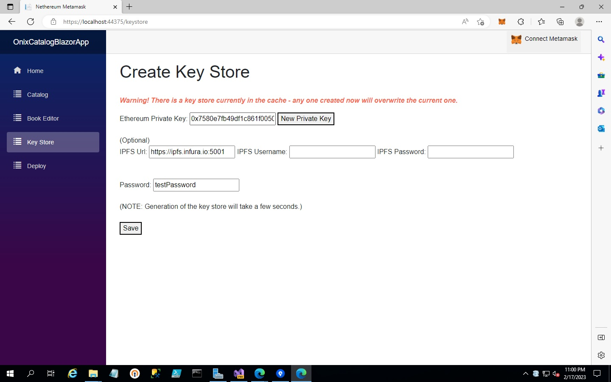

# OnixCatalogBlazorApp

## Overview
In the goal of creating UnstoppableBooksDAO, there needs to be a toolset available for decentralized publishing, since nothing is possible without one.  This project is an experimental tool to help decentralized authors/publishers/etc generate and organize the <a target="_blank" href="https://www.editeur.org/8/ONIX/">ONIX</a> v3 metadata needed when submitting books to vendors/retailers/etc.  In addition, this project also aims to showcase how one can sign the ONIX metadata with a decentralized ID (in this case, an Ethereum ID) in order to prove the validity of the metadata's origin.  An example of an ONIX file (with a signature) generated by this tool can be found <a target="_blank" href="https://github.com/UnstoppableBooksDAO/UnstoppableBooks.OnixCatalogBlazorApp/blob/main/OnixCatalogBlazorApp/wwwroot/sample-data/Secrets_of_Flukeman_by_Anonymous.xml">here</a>.

When the tool generates an ONIX file, a signature can be applied in one of two ways.  One, the user can use the <a target="_blank" href="https://metamask.io/">Metamask plugin</a>, so that the application never needs to see the private key.  (NOTE: The user will need to create or have an Ethereum ID inside their Metamask wallet in order for this option to work.)  Two, by first visiting the Key Store page, the user can create a keystore with a private key, protected with a password; the user can then later retrieve the private key from the keystore to sign the ONIX metadata.  A default private key and password are supplied on the Key Store page, as a way to demonstrate how to use this option - but they are only for demonstrative purposes.  WARNING: Do not use the default private key and password for signing real ONIX metadata, since they are not secure.

This project was built using the "Nethereum Blazor Metamask Wasm-Server Projects" template from the <a target="_blank" href="https://github.com/Nethereum/Nethereum.Templates.Pack">Templates Pack</a>, and it can easily be deployed by anyone through the creation of a free Cloudflare account and by following these <a target="_blank" href="https://developers.cloudflare.com/pages/framework-guides/deploy-a-blazor-site/">instructions</a>.

## Purpose
"Why?  Isn't Ethereum about NFTs and other scams?"  I understand your skepticism, and that's a discussion which could last hours...but in this case, the central focus is on decentralized IDs, which are a useful key component to the Ethereum platform and which work standalone.  Here, an Ethereum user address can be utilized as a way to distribute data with a computational signature (and potentially anonymously), in which the signature can be tied to other functionalty on the Ethereum platform (like DAOs).  As a silly hypothetical scenario, let's say that the artist Banksy wants to publish and distribute a book via IPFS/BitTorrent/etc, with the need to sign the book's metadata and prove that the book indeed comes from Banksy.  By using this tool, Banksy can sign the book to prove its origin, all the while maintaining anonymity.  In addition, the same Ethereum account can eventually be connected with other functionality on the platform, like a DAO to receive donations that are forwarded to other charities.

## Catalog Page

This page showcases the functionality of importing/parsing ONIX v3 files and storing the essential attributes inside records within the browser cache, using it as a persistence layer.  At this point, it's a simple table to organize and show the book metadata stored in the cache layer, but the intent of later development is to provide the user with the ability to store this catalog elsewhere, perhaps inside a deployed contract on Ethereum (used as part of a decentralized publishing DAO).

## Book Editor Page

This page showcases the functionality of creating a simple ONIX v3 file that will be saved to the Downloads folder, with the option of automatically adding the new record to the browser cache's catalog.  In addition, the user has the option of using Ethereum to sign the ONIX document with either Metamask or a keystore, the latter being also stored in the cache.  However, the first option will not be available without the installation of Metamask, and the second option won't be available without the creation of a keystore.

## Key Store Page

This page showcases the functionality of creating a keystore, which can later be used to sign ONIX files that are generated via the Book Editor page.
